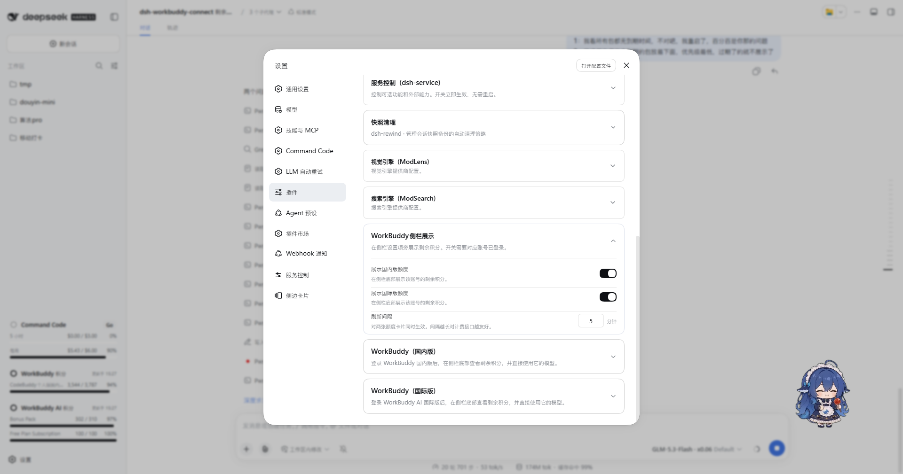
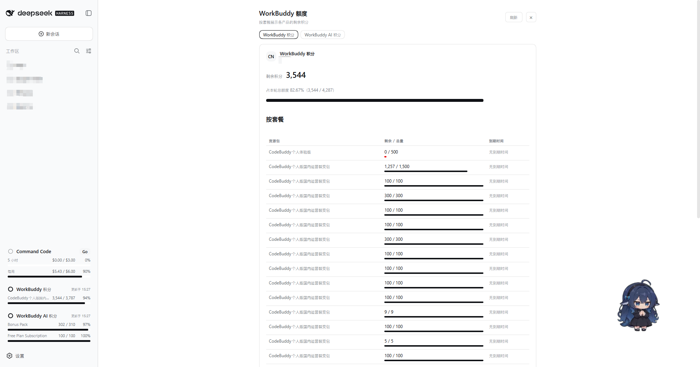
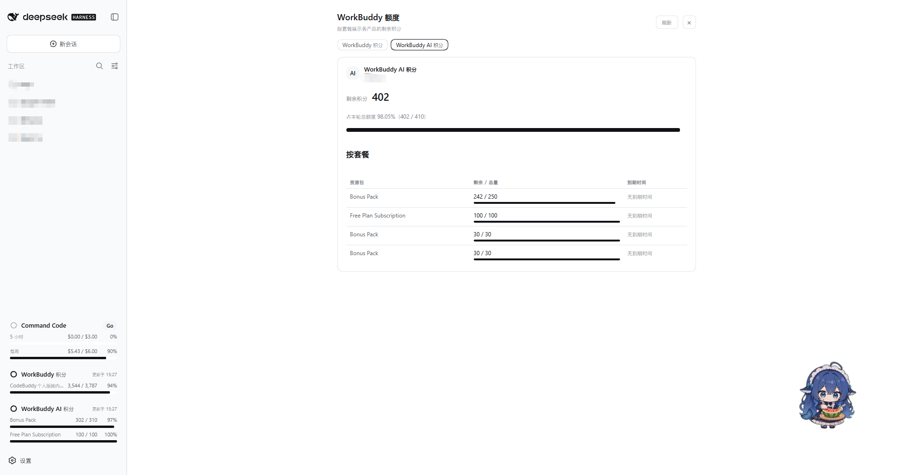

# DSH WorkBuddy Connect

English | [中文](./README.md)

Brings WorkBuddy's models (GLM-5.3, GLM-5.2, DeepSeek-V4-Pro, DeepSeek-V4-Flash, Kimi-K3, MiniMax-M3, Hy3, and more) into [DeepSeek Harness](https://github.com/deepseek-ai/deepseek-harness), usable straight from the DSH chat.

Both the CN **WorkBuddy** and the international **WorkBuddy AI** are supported: whichever one you sign in to appears as its own model group, signing in to both shows both, and each keeps its own account and credit.

**The plugin signs itself in** — the WorkBuddy desktop app is not required. Press **Sign in** on its settings card, or run `dsh-workbuddy-connect login` in a terminal, and finish in the browser. If you already have a `workbuddy.json`, you can import it instead.

## Features

- **Sign in and go**: one sign-in from the card brings the model group up, and the access token renews itself from then on.


- **CN and international side by side**: the CN product appears as the **WorkBuddy** group and the international one as **WorkBuddy AI**. Their models, accounts, and credit never mix. **Each is signed in on its own**: sign in to just the international one and only WorkBuddy AI appears; sign in to both and both groups appear; sign out of one and that group goes away. Settings likewise shows **one card per version**, each with its own account, balance, and sign-in controls.


- **Image input**: most models accept images — paste or drop one straight into the conversation (GLM-5.3-Flash, GLM-5.2, the DeepSeek-V4 series, and more); the few text-only models (e.g. GLM-5.1) clearly say so.

- **Reasoning levels**: levels explicitly declared by WorkBuddy appear directly — for example, GLM-5.3 and GLM-5.3-Flash offer low / high / max. For some models that do not declare selectable levels, Web and Desktop provide a **Reasoning levels** control in the model picker for a manual check. It sends a few requests and may consume credit. Models without a check result or selectable levels continue to use WorkBuddy's default.

- **Status and detection**: Settings → Plugins → the matching card shows the account, token validity, remaining credit, and model offers. It also lets you refresh the model list manually and shows whether the current list came from the upstream or from the built-in fallback, and provides manual reasoning-level detection for eligible models.

- **Sidebar credit display ("WorkBuddy sidebar display")**: Settings → Plugins → the topmost "WorkBuddy sidebar display" card turns the sidebar credit card on per version, with a customizable refresh interval (5 minutes by default, 1 minute minimum). When on, a credit card for that version appears at the bottom of the sidebar, next to Settings.



- **Credit details on click**: click the sidebar credit card to open that version's credit details in the center panel (click the same card again to close it; click the other card to switch versions). The panel switches between versions with tabs and shows:

  - **Overview**: the account nickname, total remaining credit, an overall bar, and its share of this cycle's granted total;
  - **Detail table**: one row per package — "package name | remaining / total + mini bar | expiry", **listed individually, unmerged, exhausted ones included**, complementing the merged overview in the sidebar; spent-but-not-yet-expired packages sort last, expired ones are not shown.

  Data is forwarded through DSH locally (the browser never holds credentials), and the sidebar card and the details page share the same latest result: refreshing either side updates both. To go easy on the billing endpoint, reopening the details page within the refresh interval reuses the cache; the "Refresh" button forces a fresh read.





- **Enterprise credit**: on the CN product, enterprise accounts (non-empty `enterpriseId`) read their cycle quota from the enterprise billing endpoint, and the card shows an "enterprise quota" row with the cycle reset time.

- **Rate**: every model name carries its credits multiplier (e.g. `GLM-5.2 · x0.79`, `Hy3 · x0.00`) in both the `/model` popup and the composer's model dropdown. The rate is display-only and never affects requests.

- **Promo badges**: promo badges (`限时免费`, `夜间折扣`) ride the model name itself (e.g. `Hy4 preview · x0.00 · 限时免费`), visible wherever you pick a model; the status card also collects currently-discounted models. Per the WorkBuddy service data, synced each time DSH starts. The international version's promotions come from the service's `modelPromotions` (which carry an effective window). Once a promotion lapses its badge is withdrawn; because the service writes the discounted value into the model's own rate field, the original price cannot be reconstructed, so that model then reports "price unavailable — refresh to update" rather than repeating the discounted rate or claiming the model is free.


The expanded card has three tabs: **Status** shows the account, token validity, total credit, catalog source, and reasoning-level detection; **Context** lists each model's context window (where the international version offers a larger declared window, the "Use the largest declared context window" switch lives here — it is **on by default**, so DSH sizes context compression to the largest window the upstream declares; turn it off to follow the upstream default instead, and the preference persists across restarts); **Details** shows per-package credit and model offers. The CN and international versions each get their own card, showing their own account's information.


## Why reasoning levels work this way

Information about WorkBuddy models' reasoning levels is currently split between upstream API responses and private UI logic in the client, while the model catalog changes quickly. If the plugin filled in one uniform set of levels for every model without an upstream declaration, it would need to keep chasing unpublished product logic with no stable contract.


Testing also found that some models accept the `reasoning_effort` parameter while ignoring unknown values and falling back to their default behavior. A successful request alone therefore does not prove that a level is actually usable.

For models without declared levels, Web and Desktop instead use user-authorized, on-demand detection: it first confirms that the upstream validates the parameter, then checks which standard levels it accepts. The check sends a few requests and may consume credit. Its result means only that the upstream currently accepts that level; it does not promise a particular change in reasoning quality, speed, or credit use.

## Upgrading from 0.5.x to 0.6.0 (important)

**0.6.0 changes where the credential comes from. It is a breaking upgrade — please read this first.**

| | 0.5.x (old) | 0.6.0 (new) |
|---|---|---|
| Credential source | the WorkBuddy desktop app's local auth file | **the plugin's own sign-in** (device authorization) |
| Desktop app required | yes | **no** |
| Credential location | `$DSH_HOME/.workbuddy-auth.json` | `$DSH_HOME/profiles/<profile>/.dsh-workbuddy-connect/` |
| Settings `authFile` / `authFileAI` | present | **removed** |

After upgrading you must **sign in once**; the old file is no longer read:

```sh
# Press Sign in on the card, or:
dsh plugin --profile web exec dsh-workbuddy-connect login
```

**Already have a `workbuddy.json`?** You can skip the browser and import it — **Choose file…** on the card, or `import --file`. The format is unchanged, with `expiresAt` in **seconds**:

```json
{
  "auth": { "accessToken": "…", "refreshToken": "…", "expiresAt": 1794051445, "domain": "copilot.tencent.com" },
  "account": { "uid": "…", "nickname": "…" },
  "region": "cn"
}
```

An import is checked against the target product: offering an international credential to the CN provider is refused with the `--provider` value that would accept it.

## Install

**Match the plugin version to your DSH core** — a mismatched combination fails to start DSH:

| Plugin | Required DSH core | Desktop app |
|---|---|---|
| **0.6.x** | `0.1.5-rc.1` or newer | not required |
| **0.3.2 – 0.5.x** (international support since `0.5.0`) | `0.1.5-rc.1` or newer | `2.0.7`+ (bundled core `0.1.5-rc.1`) |
| **0.3.0 – 0.3.1** | `0.1.2-rc.1` | `2.0.5` |
| **0.2.6** | `0.1.1-rc.2` (older line) | `2.0.3` / `2.0.4` |

- Requires DSH `0.1.5-rc.1` or newer. The `0.3.2` – `0.5.x` entries were governed by the desktop app's bundled core; this release no longer uses the desktop app.
- Installed from GitHub. The repository ships the built `lib/`, so no local build step is needed.

The plugin runs under all three DSH interfaces: **Web**, **Desktop**, and **TUI**. Pick the install command that matches the profile you use.

```sh
# Web (recommended)
dsh plugin --profile web add github:masknull/dsh-workbuddy-connect
dsh web
```

```sh
# Desktop (the DSH Desktop app)
dsh plugin --profile desktop add github:masknull/dsh-workbuddy-connect
dsh --profile desktop
```

```sh
# TUI (terminal UI)
dsh plugin --profile dsh-tui add github:masknull/dsh-workbuddy-connect
dsh --profile dsh-tui
```

Pin a specific release with a tag, e.g. `github:masknull/dsh-workbuddy-connect#v0.6.0`.

> **TUI users, check the version pairing**: the terminal UI package (`@deepseek-harness-tui/dsh-tui`) must be **`0.10.0-beta.5` or newer** — older versions fail at startup with `events is not iterable` when this plugin is installed. Update the shell first (via its built-in update command or a fresh install), then add this plugin; the newest release is a beta, and a stable one will work the same way.

> Manual reasoning-level detection is currently available only on Web and Desktop; TUI does not provide a detection action.

> Note: the `dsh-tui` profile requires pnpm 11 to install packages (a different pnpm on PATH fails with `ERR_PNPM_UNEXPECTED_STORE` — use `npx pnpm@11`).

After installing, switch to a WorkBuddy model in the model picker of the interface you chose. On Web and Desktop, the settings card shows the account, token validity, and remaining credit, can refresh the model list manually, and can check eligible models for reasoning levels. **While signed out** it offers **Sign in** (opens the browser and applies the credential when you finish) and **Choose file…** (import an existing `workbuddy.json`); **while signed in** it offers **Switch account** (discards the current credential and starts a fresh sign-in) and **Sign out**. The CN and international versions each have their own card and sign in independently.

## CLI

`dsh plugin --profile <web|desktop|dsh-tui> exec dsh-workbuddy-connect login`: sign in through the browser (prints the authorization URL, then stores the credential once you finish). This is the path for environments without the browser card, such as TUI.

`dsh plugin --profile <web|desktop|dsh-tui> exec dsh-workbuddy-connect import --file <path>`: adopt an existing credential file (the `workbuddy.json` format). `--file -` reads standard input, so a document can be piped in.

`dsh plugin --profile <web|desktop|dsh-tui> exec dsh-workbuddy-connect status`: sign-in state and remaining credit (`--json` for machine-readable output; `doctor` for diagnostics and `logout` for credential cleanup are also available).

Both commands target the CN version by default; add `--provider workbuddy-ai` for the international one:

```sh
dsh plugin --profile web exec dsh-workbuddy-connect login --provider workbuddy-ai
dsh plugin --profile web exec dsh-workbuddy-connect import --provider workbuddy-ai --file ./workbuddy-global.json
dsh plugin --profile web exec dsh-workbuddy-connect status --provider workbuddy-ai
dsh plugin --profile web exec dsh-workbuddy-connect doctor --provider workbuddy-ai
```

### Where the credential lives

Scoped per profile, under `$DSH_HOME/profiles/<profile>/.dsh-workbuddy-connect/` (by default `~/.dsh/profiles/web/.dsh-workbuddy-connect/`):

| File | Product |
|---|---|
| `.workbuddy-auth.json` | CN |
| `.workbuddy-ai-auth.json` | International |

**How the profile is determined**: DSH does not expose the active profile name to a plugin, so the plugin looks under `$DSH_HOME/profiles/` for the profile whose `package.json` **declares this plugin**; if several do, it narrows to the one whose installed copy points at this same code. The web, desktop, and TUI profiles therefore each keep their own sign-in. When none can be determined (running from a source checkout, say) it falls back to `$DSH_HOME/.dsh-workbuddy-connect/`; `DSH_WORKBUDDY_DATA_DIR` overrides either way.

### Data file layout (0.6.1)

The plugin's data files live on two levels: **credentials at the data-directory root** (secret material, kept apart from rebuildable caches so "wipe the caches" can never touch a credential), and **everything rebuildable inside `state/`**:

```
$DSH_HOME/profiles/<profile>/.dsh-workbuddy-connect/
├── .workbuddy-auth.json             # CN credential
├── .workbuddy-ai-auth.json          # international credential
└── state/
    ├── .workbuddy-catalog.json          # CN saved catalog
    ├── .workbuddy-ai-catalog.json       # international saved catalog
    ├── .workbuddy-probe.json            # CN reasoning-probe records
    ├── .workbuddy-ai-probe.json         # international reasoning-probe records
    └── .workbuddy-host-heartbeat.json   # host heartbeat (for the status CLI)
```

Upgrading from 0.6.0: files at the old locations (the `$DSH_HOME` root) are not migrated automatically. For credentials, re-signing in via "Switch account" or `import --file` is recommended; cache files (catalog/probe/heartbeat) can simply be deleted — the plugin recreates them under `state/` as needed.

Every file is written atomically (temporary file + rename) — no `.lock`, no leftover temporary file.

`logout` removes only that version's own credential file and leaves the other alone; it never touches the caches under `state/`.

## Known limitations

- **Verified on**: Windows with the DSH Web profile. The real sign-in was exercised for both the CN and international products (each returned a working authorization URL and polled correctly), a `workbuddy.json` was imported, both products read their own account and credit independently, and the settings card was compared property-by-property against the built-in card while collapsed, hovered, and expanded. Other platforms were not re-run for this release.
- Requires DSH `0.1.5-rc.1`+ and Node 22+; TUI requires the terminal UI package `0.10.0-beta.5` or newer (see the Install section). The credential comes from the plugin's own sign-in, so whether the WorkBuddy desktop app is installed — and where it keeps its state — makes no difference.
- **The international version's login is unreachable on some networks**: `www.workbuddy.ai` cannot be reached from parts of mainland China, so an international sign-in fails there and reports why. The CN version is unaffected.
- **The international version's model catalog comes from the app's own interface**: the service splits it by User-Agent, which is a private implementation detail that a server-side change can break. When that happens the plugin degrades to this account's last successful catalog and then to its built-in roster, showing the source (live / saved / built-in), the fetch time, and the failure reason on the card — but long-term compatibility is not guaranteed. The CN version's catalog uses the same interface as the official CLI and is unaffected.
- **International catalog User-Agent version**: on Windows / WSL / Linux the international app's version cannot be read, so the saved value or the built-in default is used. This concerns the catalog request only; signing in does not depend on the desktop app.
- **Behaviour with no credential**: a version nobody has signed in to shows no model group, because every model it could list would fail on use. The group appears as soon as you sign in.
- **Sidebar display request throttling**: the sidebar cards and the details page share one data snapshot, throttled by the configured interval — reopening the page or panel within the interval reuses the cache instead of hitting the billing endpoint again; the "Refresh" button on the details page bypasses the interval and forces a fresh read. A very short interval means a correspondingly higher request rate against the billing endpoint, so set it with care.
- **The enterprise credit path currently covers the CN product only**: the international enterprise billing interface is unverified, so those accounts still read through the personal endpoint pending measurement. The enterprise branch could not be tested locally (the development machine holds a personal account); it was implemented from the official app's interface contract, and reports from enterprise users are welcome.
- Relies on WorkBuddy client interfaces (not a public API); the plugin may need updates as WorkBuddy changes.

## Disclaimer

- This project is for **personal learning and research only**, driving your own WorkBuddy account on your own machine. Do not use it commercially or beyond reasonable personal use.
- Users must comply with the WorkBuddy terms of service. Any consequence of using this project (including but not limited to account restrictions, depleted credit, or service interruption) is borne by the user.
- The author is not liable for any direct or indirect loss arising from the use or misuse of this project.
- This project is not affiliated with, endorsed by, or sponsored by Tencent, WorkBuddy, or DeepSeek. Product names are used for compatibility description only; trademarks belong to their respective owners.

## Acknowledgements

- [Sliverkiss/workbuddy2api](https://github.com/Sliverkiss/workbuddy2api) (MIT) — reference implementation of the WorkBuddy upstream protocol. The 0.6.0 sign-in flow and upstream calls (headers, body rewrites, endpoint selection, error classification) follow this implementation.
- [zqcccc/workbuddy-cliproxy](https://github.com/zqcccc/workbuddy-cliproxy) — an early reference for the device-authorization sign-in flow.
- [franksong2702/dsh-codex-connect](https://github.com/franksong2702/dsh-codex-connect) (Apache-2.0) — reference for the DSH plugin structure and provider registration.
- [corrinehu/dsh-workbuddy-connect](https://github.com/corrinehu/dsh-workbuddy-connect) — the upstream of this repository.

## License

[MIT](./LICENSE)
